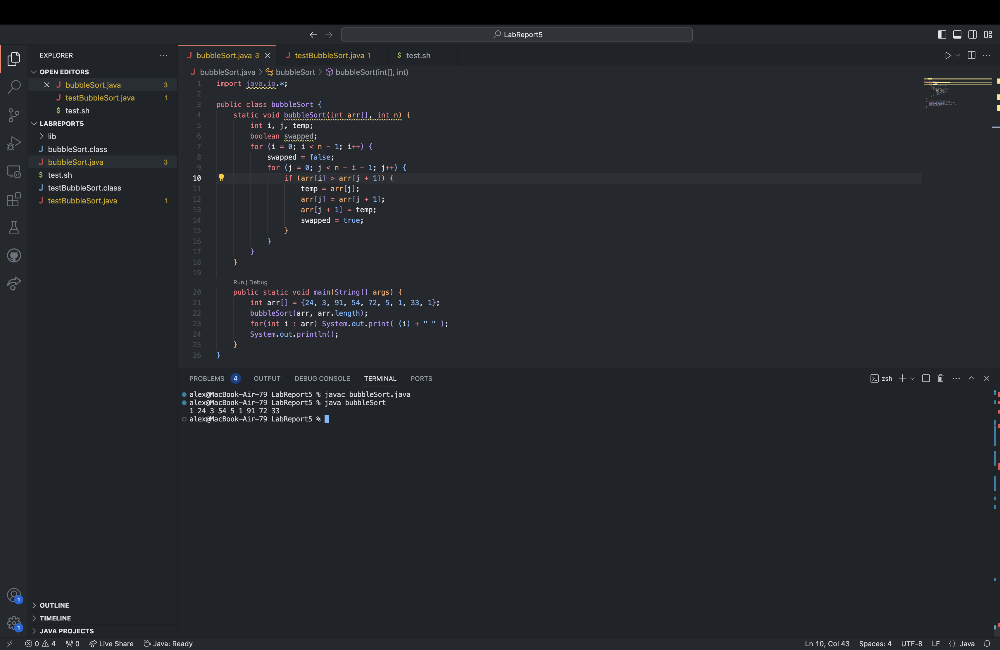
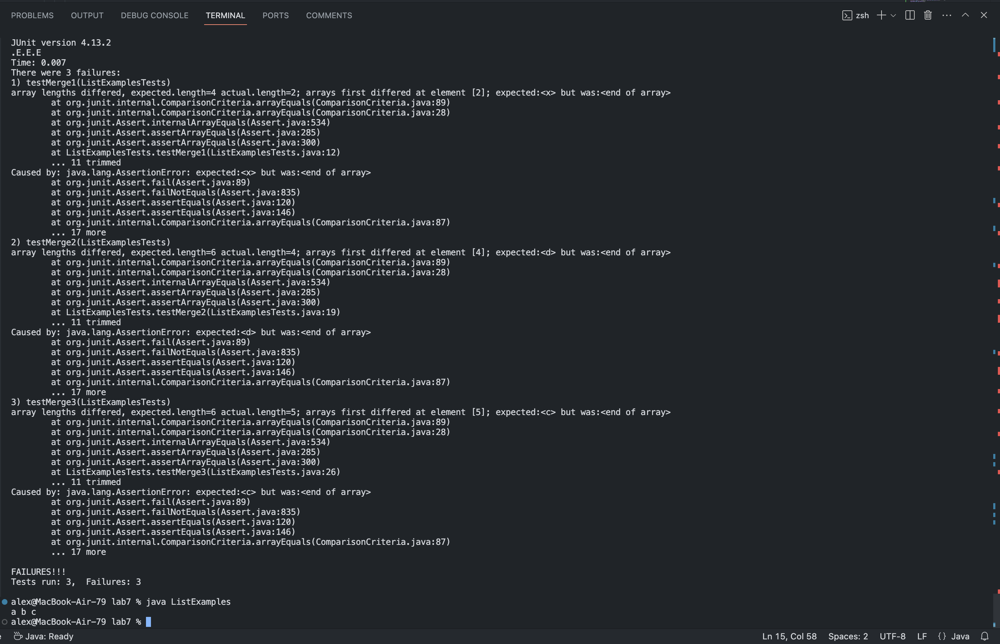
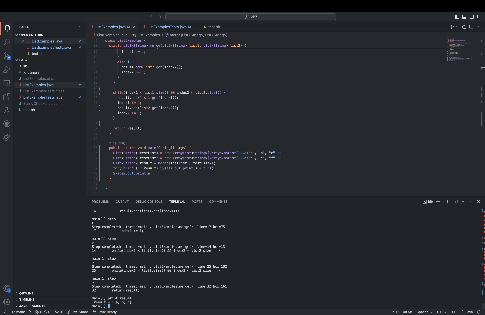

## Part 1 - Debugging Scenario
Student: Hello TA, I am trying to figure out what is wrong with my merge method. It is not merging at all and the symptom is that the result from merge is only list2. My guess is that the bug lies somewhere I add elements from list1 or list2 into result. Please help.

