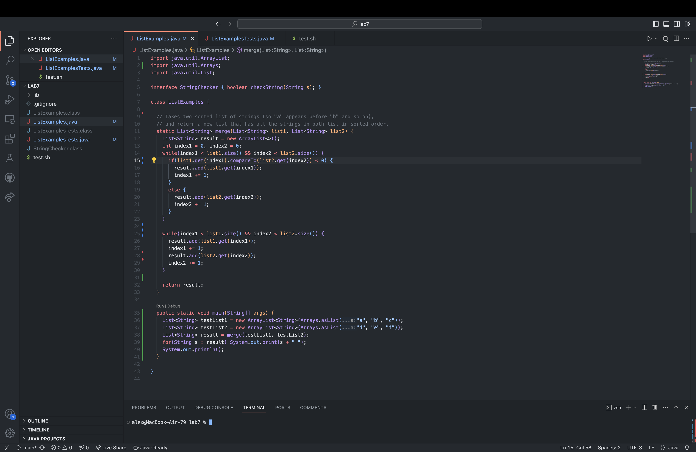

## Part 1 - Debugging Scenario
Student: Hello TA, I am trying to figure out what is wrong with my merge method. It is not merging at all and the symptom is that the result from merge is only list2. My guess is that the bug lies somewhere I add elements from list1 or list2 into result. Please help.


TA: Hello student, have you tried stepping through your merge method to see where the problem may lie? I suggest you run jdb and keep track of local variables and see if the method breaks off at any point to find where the problem is. 

Student: Thank you! I was able to find where the merge method breaks off from and find out that the List wasn't merging at all. I found out the issue lied in the second while loop in the merge method. The bug was that I had to first loop through list1 and add those elements to result first before adding elements from list2. 


File Structure
```
lab7
|- lib
   |- hamcrest-core-1.3.jar
   |- junit-4.13.2.jar
|- .gitignore
|- ListExamples.class
|- ListExamples.java
|- ListExamplesTests.class
|- ListExamplesTests.java
|- StringChecker.class
|- test.sh
``` 
Contents of files before fixing bug

ListExamples.java
```
import java.util.ArrayList;
import java.util.Arrays;
import java.util.List;

interface StringChecker { boolean checkString(String s); }

class ListExamples {

  // Takes two sorted list of strings (so "a" appears before "b" and so on),
  // and return a new list that has all the strings in both list in sorted order.
  static List<String> merge(List<String> list1, List<String> list2) {
    List<String> result = new ArrayList<>();
    int index1 = 0, index2 = 0;
    while(index1 < list1.size() && index2 < list2.size()) {
      if(list1.get(index1).compareTo(list2.get(index2)) < 0) { 
        result.add(list1.get(index1));
        index1 += 1;
      }
      else {
        result.add(list2.get(index2));
        index2 += 1;
      }
    }

    while(index1 < list1.size() && index2 < list2.size()) {
      result.add(list1.get(index1));
      index1 += 1;
      result.add(list2.get(index2));
      index2 += 1;
    }
    
    return result;
  }

  public static void main(String[] args) {
    List<String> testList1 = new ArrayList<String>(Arrays.asList("a", "b", "c"));
    List<String> testList2 = new ArrayList<String>(Arrays.asList("d", "e", "f"));
    List<String> result = merge(testList1, testList2);
    for(String s : result) System.out.print(s + " ");
    System.out.println();
  }

}
```
ListExamplesTests.java
```
import static org.junit.Assert.*;
import org.junit.*;
import java.util.*;
import java.util.ArrayList;


public class ListExamplesTests {
	@Test(timeout = 500)
	public void testMerge1() {
    List<String> l1 = new ArrayList<String>(Arrays.asList("x", "y"));
		List<String> l2 = new ArrayList<String>(Arrays.asList("a", "b"));
		assertArrayEquals(new String[]{ "a", "b", "x", "y"}, ListExamples.merge(l1, l2).toArray());
	}
	
	@Test(timeout = 500)
  public void testMerge2() {
		List<String> l1 = new ArrayList<String>(Arrays.asList("a", "b", "c"));
		List<String> l2 = new ArrayList<String>(Arrays.asList("c", "d", "e"));
		assertArrayEquals(new String[]{ "a", "b", "c", "c", "d", "e" }, ListExamples.merge(l1, l2).toArray());
        }

	@Test(timeout = 500)
  public void testMerge3() {
		List<String> l1 = new ArrayList<String>(Arrays.asList("a", "b", "c"));
		List<String> l2 = new ArrayList<String>(Arrays.asList("a", "b", "c"));
		assertArrayEquals(new String[]{ "a", "a", "b", "b", "c", "c" }, ListExamples.merge(l1, l2).toArray());
		}
}
```
test.sh
```
javac -cp .:lib/hamcrest-core-1.3.jar:lib/junit-4.13.2.jar *.java
java -cp .:lib/hamcrest-core-1.3.jar:lib/junit-4.13.2.jar org.junit.runner.JUnitCore ListExamplesTests
```
Command line to trigger bug
```
bash test.sh
java ListExamples
```
We need to edit the second while loop and split it into two different loops. It can not be done in one loop because the lists must be added to result one at a time. 

After fix:
```
while(index1 < list1.size()) {
  result.add(list1.get(index1));
  index1 += 1;
}
    
while(index2 < list2.size()) {
  result.add(list2.get(index2));
  index2 += 1;
}
```

## Part 2 - Reflection
I feel like I have learned a whole lot about debugging. I used to be a spam print statements type of guy where I would add print statements to track my variables. Now that I've learned to use debugging tools like JUnit and jdb I feel much more confident as a debugger. It felt great to be able to propely test methods and keep track of variables and follow my program step by step using jdb. I also liked learning more about bash scripts because it definitely made running terminal commands much more efficient where I can just run the script which contains the commands that I want to run.
